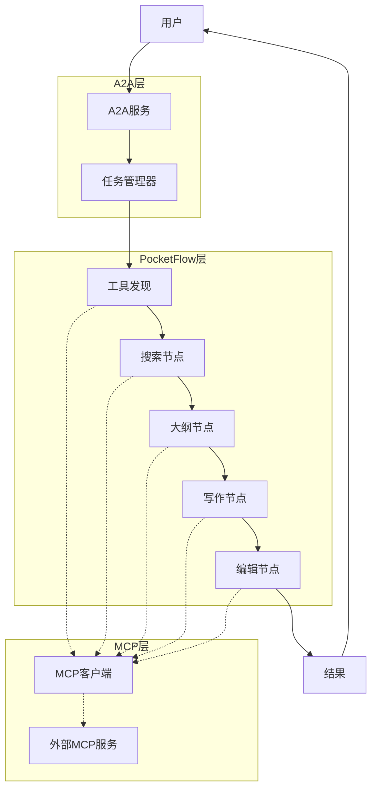

# 多代理协作故事生成器

基于PocketFlow框架的多代理协作故事生成系统，集成A2A（Agent-to-Agent）通信协议和MCP（Machine-Centric Protocol）工具调用机制。

## 项目概述

本项目展示了如何使用PocketFlow框架构建一个故事生成系统，通过多个专业化节点的协同工作，完成从用户提示到生成完整故事的流程。系统通过A2A协议处理用户请求，并使用MCP协议连接外部工具服务。

### 系统架构

系统采用三层架构：

1. **A2A服务层**：处理用户请求和任务管理
2. **PocketFlow核心层**：实现故事生成的流程和决策逻辑
3. **MCP调用层**：连接外部MCP工具服务，提供搜索、大纲生成、写作和编辑功能



## 主要功能

- **异步流程处理**：采用异步编程模型，支持并行执行和流式处理
- **MCP工具集成**：直接调用外部MCP工具服务，降低开发复杂度
- **错误处理机制**：包含重试策略和异常管理
- **进度跟踪**：提供任务进度更新
- **配置灵活**：支持多种故事生成选项和服务配置

## 安装和依赖

### 环境要求
- Python 3.8+
- PocketFlow框架
- FastAPI (用于A2A服务)
- 网络连接（用于访问MCP服务）

### 安装步骤

1. 克隆项目仓库：
```bash
git clone https://github.com/koriyoshi2041/A2A_with_MCP.git
```

2. 安装依赖：
```bash
pip install -r requirements.txt
```

3. 设置环境变量（可选）：
```bash
export MCP_SERVICE_URL=your_mcp_url   # MCP服务URL
export LOG_LEVEL=INFO                 # 日志级别
```

## 使用方法

### 配置MCP服务

编辑`config.py`文件，设置MCP服务连接参数：

```python
# MCP服务配置
MCP_SERVICE_HOST = "your-mcp-host"  # MCP服务主机
MCP_SERVICE_PORT = 8000             # MCP服务端口
MCP_SERVICE_TIMEOUT = 30            # 请求超时时间(秒)
```

### 启动A2A服务

```bash
python a2a_server.py
```

默认情况下，服务将在`http://localhost:5000`启动。

### 发送故事生成请求

使用HTTP客户端向A2A服务发送请求：

```bash
curl -X POST http://localhost:5000/api/tasks \
  -H "Content-Type: application/json" \
  -d '{
    "task": {
      "input": {
        "content": "创作一个关于太空探险的科幻故事",
        "style": "sci-fi",
        "length": "medium",
        "tone": "adventurous"
      }
    }
  }'
```

### 查询任务状态和结果

```bash
curl http://localhost:5000/api/tasks/{task_id}
```

## MCP协议集成

系统通过MCP客户端调用外部MCP服务，目前支持以下工具类型：

| 服务类型 | 功能描述 |
|---------|---------|
| search  | 搜索相关信息 |
| outline | 生成故事大纲 |
| writing | 写作故事内容 |
| editing | 润色和编辑  |

当外部MCP服务不可用时，系统会记录错误并尝试提供合理的替代方案。

## 系统组件

系统主要包括以下组件：

1. **A2A服务器**: 处理用户请求，管理任务和进度更新
2. **流程节点**: 
   - `ToolDiscoveryNode`: 发现可用MCP工具
   - `SearchNode`: 查询相关信息
   - `OutlineNode`: 生成故事大纲
   - `StoryWritingNode`: 撰写故事内容
   - `StoryEditingNode`: 润色完整故事
   - `ErrorHandlingNode`: 处理错误和异常
3. **共享存储**: 在节点间传递数据
4. **MCP客户端**: 与外部MCP服务交互


## 扩展和定制

### 自定义MCP服务URL

可以通过环境变量为每种服务类型指定不同的MCP服务URL：

```bash
export MCP_SEARCH_SERVICE_URL="http://search-service.example.com/api"
export MCP_OUTLINE_SERVICE_URL="http://outline-service.example.com/api"
```

### 调整生成参数

编辑`config.py`中的默认参数，或在创建任务时传递自定义选项：

```json
{
  "task": {
    "input": {
      "content": "创作故事",
      "style": "mystery",
      "length": "long",
      "tone": "suspenseful"
    }
  }
}
```

## 许可

本项目基于[MIT许可证](https://github.com/koriyoshi2041/A2A_with_MCP/blob/main/LICENSE)开源。

## 状态和限制

- 当前系统依赖外部MCP服务提供故事生成能力
- 目前仅支持基本的故事生成流程，更复杂的互动式故事创作功能尚在开发中