# 多代理协作故事生成器 - 概念架构图

本文档使用Mermaid图表展示系统各组件之间的关系，帮助开发者理解整体架构。

## 系统层次结构

## 数据流图

```mermaid
sequenceDiagram
    participant User as 用户
    participant Client as A2A客户端
    participant Server as A2A服务器
    participant TaskMgr as 任务管理器
    participant Flow as PocketFlow流程
    participant MCP as MCP服务
    
    User->>Client: 故事请求
    Client->>Server: 发送任务请求
    Server->>TaskMgr: 创建任务
    TaskMgr->>Flow: 初始化流程
    
    Note over Flow: 开始故事生成流程
    
    Flow->>MCP: 获取可用工具
    MCP-->>Flow: 返回工具列表
    
    loop 故事创作循环
        Flow->>Flow: 决策下一步行动
        
        alt 搜索相关信息
            Flow->>MCP: 调用搜索服务
            MCP-->>Flow: 返回搜索结果
            Flow->>TaskMgr: 更新进度(25%)
        else 生成故事大纲
            Flow->>MCP: 调用大纲服务
            MCP-->>Flow: 返回结构化大纲
            Flow->>TaskMgr: 更新进度(50%)
        else 写作故事章节
            Flow->>MCP: 调用写作服务(并行)
            MCP-->>Flow: 返回故事章节
            Flow->>TaskMgr: 更新进度(75%)
        else 润色完整故事
            Flow->>MCP: 调用润色服务
            MCP-->>Flow: 返回完整故事
            Flow->>TaskMgr: 更新进度(95%)
        end
    end
    
    Flow->>TaskMgr: 完成任务(100%)
    TaskMgr->>Server: 更新任务状态
    Server-->>Client: 实时进度更新
    Client-->>User: 显示进度和结果
```

## 组件依赖关系

## 节点决策流程

## 可扩展性设计

系统设计允许通过以下方式扩展功能：

1. 添加新的MCP服务类型
2. 自定义节点类型以支持新的流程步骤
3. 扩展A2A协议以支持更多客户端类型

这些扩展可以在不改变核心架构的情况下实现，保持系统的灵活性和可扩展性。 