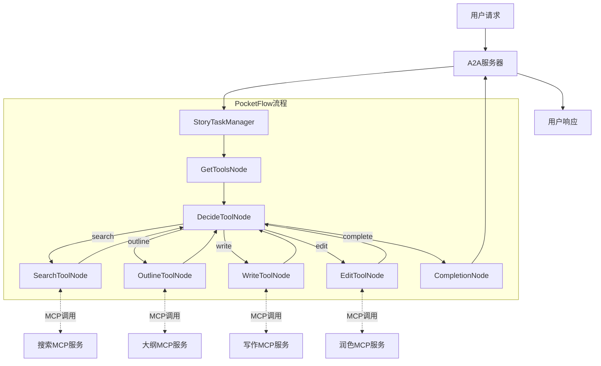

# 多代理协作故事生成器设计方案（改进版）

> 基于PocketFlow框架，结合A2A和MCP协议的复杂代理系统

## 1. 需求分析

### 1.1 系统目标

构建一个多代理协作的创意写作系统，它需要：
- 接收用户故事创作需求
- 协调7个专业代理协作完成故事创作
- 通过A2A协议对外提供服务
- 利用现有MCP协议工具提供专业能力
- 全系统基于PocketFlow框架实现

### 1.2 代理角色分工

- **Agent1 (研究代理)**: 搜索与故事需求相关的信息
- **Agent2 (大纲代理)**: 结合搜索信息和需求生成四部分结构化大纲
- **Agent3-6 (写作代理)**: 负责按次序为大纲的每一部分创作内容
- **Agent7 (润色代理)**: 对完成的故事进行润色和最终编辑

## 2. 架构设计

基于对PocketFlow框架中A2A和MCP协议的理解，我们设计一个三层架构：

1. **A2A服务层**：处理用户请求和任务管理
2. **PocketFlow核心层**：实现故事生成的流程和决策逻辑
3. **MCP工具层**：连接现有MCP服务获取专业能力

### 2.1 系统流程图



### 2.2 设计要点

1. **工具发现与决策**：
   - 系统首先从现有MCP服务发现可用工具
   - 然后基于当前状态决定使用哪个工具
   - 系统可以在多个工具之间自由切换，形成自反馈循环

2. **流式状态更新**：
   - 支持A2A协议的流式响应特性
   - 实时报告任务进度和阶段信息
   - 允许用户在长时间运行的任务中获取中间结果

3. **弹性错误处理**：
   - 在MCP服务不可用时提供本地回退方案
   - 实现智能重试机制处理临时故障
   - 保存部分结果，避免完全失败

## 3. 工具层设计

我们将使用现有的MCP服务，而不是自行实现MCP协议。对于每种专业能力，我们需要：

1. **连接到现有MCP服务**
2. **提供本地回退实现**作为备用

### 3.1 MCP工具使用方式

```python
# 使用MCP工具的方式
def get_tools(server_script_path):
    """从MCP服务器获取可用工具列表"""
    # 当全局变量MCP=True时，连接到实际MCP服务器
    # 当MCP=False时，使用本地模拟实现
    return tools_list

def call_tool(server_script_path, tool_name, arguments):
    """调用MCP工具函数"""
    # 当MCP=True时，通过MCP协议调用实际服务
    # 当MCP=False时，执行本地实现
    return result
```

### 3.2 需要的MCP工具服务

| 服务名称 | 主要工具 | 功能描述 |
|---------|---------|---------|
| search_service | search_relevant_information | 查询与故事主题相关的信息 |
| outline_service | generate_structured_outline | 生成四部分结构化故事大纲 |
| writing_service | write_story_section | 根据大纲撰写故事章节 |
| editing_service | polish_story | 优化和润色完整故事 |

### 3.3 本地回退实现

我们需要为每个MCP工具提供本地实现，以便在MCP服务不可用时使用：

```python
def local_get_tools(server_script_path=None):
    """本地工具发现回退实现"""
    # 根据服务器路径返回对应的模拟工具列表
    if server_script_path == "search_service.py":
        tools = [
            {
                "name": "search_relevant_information",
                "description": "查询与故事主题相关的信息",
                "inputSchema": {
                    "properties": {
                        "topic": {"type": "string"},
                        "depth": {"type": "integer"}
                    },
                    "required": ["topic"]
                }
            }
        ]
    elif server_script_path == "outline_service.py":
        tools = [
            {
                "name": "generate_structured_outline",
                "description": "生成结构化故事大纲",
                "inputSchema": {
                    "properties": {
                        "topic": {"type": "string"},
                        "research": {"type": "array"}
                    },
                    "required": ["topic"]
                }
            }
        ]
    # 同样为writing_service和editing_service提供本地实现
    
    # 将字典转换为对象，模拟MCP API返回
    return [DictObject(tool) for tool in tools]

def local_call_tool(server_script_path=None, tool_name=None, arguments=None):
    """本地工具调用回退实现"""
    # 根据服务器路径和工具名称选择对应的本地实现
    if server_script_path == "search_service.py" and tool_name == "search_relevant_information":
        return local_search(arguments.get("topic"), arguments.get("depth", 3))
    elif server_script_path == "outline_service.py" and tool_name == "generate_structured_outline":
        return local_outline(arguments.get("topic"), arguments.get("research", []))
    # 同样为其他工具提供本地实现
```

### 3.4 异步调用支持

为了支持流式响应和并行处理，我们需要提供异步版本的工具调用：

```python
async def call_tool_async(server_script_path, tool_name, arguments):
    """异步调用MCP工具"""
    # 异步版本的工具调用
    return await _call_tool_async(server_script_path, tool_name, arguments)
```

## 4. PocketFlow节点设计

基于对pocketflow-mcp和pocketflow-a2a项目的分析，我们设计以下关键节点：

### 4.1 工具发现节点

```python
class GetStoryToolsNode(Node):
    """从MCP服务器获取可用工具"""
    
    def prep(self, shared):
        """准备服务器路径列表"""
        return ["search_service.py", "outline_service.py", 
                "writing_service.py", "editing_service.py"]
    
    def exec(self, service_paths):
        """获取所有服务的工具列表"""
        all_tools = {}
        for path in service_paths:
            tools = get_tools(path)
            all_tools[path] = tools
        return all_tools
    
    def post(self, shared, prep_res, exec_res):
        """存储工具信息并格式化提示"""
        # 存储原始工具信息
        shared["tools"] = exec_res
        
        # 为LLM格式化工具信息，便于决策
        tool_descriptions = []
        for server, tools in exec_res.items():
            for tool in tools:
                tool_info = {
                    "name": tool.name,
                    "server": server,
                    "description": tool.description,
                    # 添加格式化的工具描述
                }
                tool_descriptions.append(tool_info)
        
        shared["tool_descriptions"] = tool_descriptions
        return "decide"
```

### 4.2 决策节点

```python
class DecideStoryAction(Node):
    """核心决策节点，决定下一步使用哪个工具"""
    
    def prep(self, shared):
        """准备决策提示"""
        # 获取当前故事状态
        story_state = shared.get("story_state", "initial")
        user_request = shared.get("story_request", "")
        search_results = shared.get("search_results", [])
        outline = shared.get("outline", {})
        sections = shared.get("sections", [])
        draft_story = shared.get("draft_story", "")
        
        # 获取工具描述
        tool_descriptions = shared.get("tool_descriptions", [])
        formatted_tools = self._format_tools_for_prompt(tool_descriptions)
        
        # 创建提示
        prompt = f"""
### CONTEXT
You are a story creation assistant orchestrating a multi-step story generation process.

Current story state: {story_state}
User request: {user_request}

Available information:
- Search results: {len(search_results)} items
- Outline sections: {len(outline.keys()) if outline else 0}
- Written sections: {len(sections)}
- Draft story status: {"Available" if draft_story else "Not created yet"}

### AVAILABLE TOOLS
{formatted_tools}

### TASK
Determine the next step in the story creation process based on the current state.

## NEXT ACTION
Analyze the current state and decide which tool to use next.
Return your response in this format:

```yaml
thinking: |
    <your step-by-step reasoning about the current state and what needs to be done next>
action: <search/outline/write/edit/complete>
tool: <name of the specific tool to use>
server: <server path for the tool>
reason: <why you chose this action and tool>
parameters:
    <parameter_name>: <parameter_value>
    <parameter_name>: <parameter_value>
```
"""
        return prompt
    
    def exec(self, prompt):
        """调用LLM进行决策"""
        response = call_llm(prompt)
        return response
    
    def post(self, shared, prep_res, exec_res):
        """解析决策并更新状态"""
        try:
            # 解析YAML格式的决策
            yaml_str = exec_res.split("```yaml")[1].split("```")[0].strip()
            decision = yaml.safe_load(yaml_str)
            
            # 提取决策信息
            action = decision.get("action", "")
            tool = decision.get("tool", "")
            server = decision.get("server", "")
            parameters = decision.get("parameters", {})
            
            # 存储决策信息
            shared["current_action"] = action
            shared["current_tool"] = tool
            shared["current_server"] = server
            shared["current_parameters"] = parameters
            shared["thinking"] = decision.get("thinking", "")
            
            # 更新故事状态
            if action != shared.get("story_state", "initial"):
                shared["story_state"] = action
            
            # 根据行动返回下一步
            return action
            
        except Exception as e:
            print(f"❌ 解析LLM响应出错: {e}")
            # 默认继续决策
            return "decide"
```

### 4.3 工具执行节点

以下是搜索工具节点示例，其他工具节点（大纲、写作、润色）采用类似模式：

```python
class SearchToolNode(AsyncNode):
    """执行搜索工具的节点"""
    
    async def prep_async(self, shared):
        """准备搜索参数"""
        tool = shared["current_tool"]
        server = shared["current_server"]
        parameters = shared["current_parameters"]
        task_id = shared["task_id"]
        return tool, server, parameters, task_id
    
    async def exec_async(self, inputs):
        """调用搜索MCP工具"""
        tool, server, parameters, task_id = inputs
        
        # 更新任务进度
        await update_task_progress(
            task_id,
            25,
            f"正在搜索相关信息：{parameters.get('topic', '')}"
        )
        
        # 执行MCP工具调用
        result = await call_tool_async(server, tool, parameters)
        return result
    
    async def post_async(self, shared, prep_res, exec_res):
        """处理搜索结果"""
        # 保存搜索结果
        shared["search_results"] = exec_res
        
        # 更新任务进度
        await update_task_progress(
            shared["task_id"],
            30,
            "搜索完成，正在分析结果"
        )
        
        # 返回到决策节点
        return "decide"
```

### 4.4 写作节点（使用并行批处理）

```python
class WriteToolNode(AsyncParallelBatchNode):
    """故事章节写作节点（并行处理）"""
    
    async def prep_async(self, shared):
        """准备写作任务列表"""
        outline = shared.get("outline", {})
        # 将每个章节转换为单独的写作任务
        tasks = []
        for section_name, section_outline in outline.items():
            tasks.append({
                "section_name": section_name,
                "outline": section_outline,
                "task_id": shared["task_id"]
            })
        return tasks
    
    async def exec_async(self, task):
        """并行写作单个章节"""
        section_name = task["section_name"]
        outline = task["outline"]
        task_id = task["task_id"]
        
        # 更新进度
        await update_task_progress(
            task_id,
            60 + len(shared.get("sections", [])) * 5,
            f"正在写作章节：{section_name}"
        )
        
        # 调用MCP工具
        content = await call_tool_async(
            "writing_service.py",
            "write_story_section",
            {
                "section_name": section_name,
                "outline": outline
            }
        )
        
        return {
            "section_name": section_name,
            "content": content
        }
    
    async def post_async(self, shared, prep_res, exec_res_list):
        """合并所有章节内容"""
        # 按章节顺序排序
        sections = shared.get("sections", [])
        sections.extend(exec_res_list)
        
        # 保存章节内容
        shared["sections"] = sections
        
        # 创建初步草稿
        section_texts = [s["content"] for s in sections]
        shared["draft_story"] = "\n\n".join(section_texts)
        
        # 更新进度
        await update_task_progress(
            shared["task_id"],
            80,
            "写作完成，准备润色"
        )
        
        return "decide"
```

### 4.5 完成节点

```python
class CompletionNode(AsyncNode):
    """完成故事生成流程，准备最终结果"""
    
    async def prep_async(self, shared):
        """准备最终结果"""
        return shared["draft_story"], shared["task_id"]
    
    async def exec_async(self, inputs):
        """格式化最终输出"""
        draft_story, task_id = inputs
        
        # 更新任务进度
        await update_task_progress(
            task_id,
            100,
            "故事创作完成",
            [{"type": "text", "text": "故事创作已完成"}]
        )
        
        return draft_story
    
    async def post_async(self, shared, prep_res, exec_res):
        """存储最终结果"""
        shared["final_story"] = exec_res
        return "done"
```

## 5. A2A与任务管理设计

为了将上述PocketFlow节点与A2A协议集成，我们需要设计专门的TaskManager。

### 5.1 任务管理器设计

```python
class StoryGenerationTaskManager:
    """故事生成任务管理器，连接A2A协议与PocketFlow"""
    
    def __init__(self):
        """初始化任务管理器"""
        self.tasks = {}  # 任务状态存储
        self.task_locks = {}  # 任务锁，防止并发问题
        self.task_subscribers = {}  # 任务订阅者，用于流式更新
        
        # 初始化PocketFlow
        self._initialize_flow()
    
    def _initialize_flow(self):
        """初始化PocketFlow流程"""
        # 创建节点
        self.get_tools = GetStoryToolsNode()
        self.decide = DecideStoryAction()
        self.search = SearchToolNode()
        self.outline = OutlineToolNode()
        self.write = WriteToolNode()
        self.edit = EditToolNode() 
        self.complete = CompletionNode()
        
        # 配置流程
        self.get_tools >> self.decide
        
        # 配置决策分支
        self.decide - "search" >> self.search
        self.decide - "outline" >> self.outline
        self.decide - "write" >> self.write
        self.decide - "edit" >> self.edit
        self.decide - "complete" >> self.complete
        
        # 所有工具节点回到决策节点
        self.search - "decide" >> self.decide
        self.outline - "decide" >> self.decide
        self.write - "decide" >> self.decide
        self.edit - "decide" >> self.decide
        
        # 创建异步流
        self.flow = AsyncFlow(start=self.get_tools)
    
    async def handle_task_send(self, request):
        """处理任务发送请求"""
        try:
            # 提取请求数据
            task_id = request["id"]
            session_id = request.get("session_id", str(uuid.uuid4()))
            content = request["content"]
            
            # 初始化任务状态
            self.tasks[task_id] = {
                "status": "WORKING",
                "progress": 0,
                "message": "任务初始化中",
                "result": None,
                "session_id": session_id,
                "artifacts": []
            }
            
            # 创建任务锁
            self.task_locks[task_id] = asyncio.Lock()
            
            # 异步执行任务
            asyncio.create_task(self._process_task(task_id, content))
            
            # 返回初始响应
            return {
                "status": "WORKING",
                "id": task_id,
                "artifacts": [{
                    "mime_type": "text/plain", 
                    "data": "任务已接收，正在处理中"
                }]
            }
        
        except Exception as e:
            print(f"处理任务发送请求出错: {e}")
            return {
                "status": "FAILED",
                "id": task_id if 'task_id' in locals() else request.get("id", "unknown"),
                "error": str(e)
            }
    
    async def handle_task_subscribe(self, request):
        """处理任务状态订阅请求"""
        task_id = request["id"]
        
        # 检查任务是否存在
        if task_id not in self.tasks:
            return {
                "status": "FAILED",
                "error": "任务不存在"
            }
        
        # 记录订阅者
        if task_id not in self.task_subscribers:
            self.task_subscribers[task_id] = []
        
        # 创建响应队列
        response_queue = asyncio.Queue()
        self.task_subscribers[task_id].append(response_queue)
        
        # 立即提供当前状态
        current_state = self.tasks[task_id]
        await response_queue.put({
            "status": current_state["status"],
            "progress": current_state["progress"],
            "message": current_state["message"],
            "id": task_id,
            "artifacts": current_state.get("artifacts", [])
        })
        
        # 返回响应生成器
        async def response_generator():
            while True:
                try:
                    # 等待下一个状态更新
                    update = await response_queue.get()
                    yield update
                    
                    # 如果任务完成或失败，结束流
                    if update["status"] in ["COMPLETED", "FAILED"]:
                        break
                        
                except asyncio.CancelledError:
                    break
        
        return response_generator()
    
    async def _process_task(self, task_id, content):
        """处理故事生成任务"""
        try:
            # 初始化共享存储
            shared = {
                "task_id": task_id,
                "story_request": content,
                "story_state": "initial",
                "sections": []
            }
            
            # 运行PocketFlow
            await self.flow.run_async(shared)
            
            # 提取结果
            final_story = shared.get("final_story", "无法生成故事")
            
            # 更新任务状态
            async with self.task_locks[task_id]:
                self.tasks[task_id].update({
                    "status": "COMPLETED",
                    "progress": 100,
                    "message": "故事生成完成",
                    "result": final_story,
                    "artifacts": [{
                        "mime_type": "text/plain",
                        "data": final_story
                    }]
                })
            
            # 通知所有订阅者
            await self._notify_subscribers(task_id)
            
        except Exception as e:
            print(f"处理任务出错: {e}")
            # 更新任务状态为失败
            async with self.task_locks[task_id]:
                self.tasks[task_id].update({
                    "status": "FAILED",
                    "message": f"任务处理失败: {str(e)}",
                    "artifacts": [{
                        "mime_type": "text/plain",
                        "data": f"生成故事时发生错误: {str(e)}"
                    }]
                })
            
            # 通知所有订阅者
            await self._notify_subscribers(task_id)
    
    async def update_task_progress(self, task_id, progress, message, artifacts=None):
        """更新任务进度"""
        if task_id not in self.tasks:
            return
        
        # 更新任务状态
        async with self.task_locks[task_id]:
            self.tasks[task_id].update({
                "progress": progress,
                "message": message
            })
            
            # 更新文档，如果有的话
            if artifacts:
                self.tasks[task_id]["artifacts"] = artifacts
        
        # 通知所有订阅者
        await self._notify_subscribers(task_id)
    
    async def _notify_subscribers(self, task_id):
        """通知所有任务订阅者"""
        if task_id not in self.task_subscribers:
            return
        
        # 获取当前任务状态
        task_state = self.tasks[task_id]
        
        # 创建通知
        notification = {
            "status": task_state["status"],
            "progress": task_state["progress"],
            "message": task_state["message"],
            "id": task_id,
            "artifacts": task_state.get("artifacts", [])
        }
        
        # 通知所有订阅者
        for queue in self.task_subscribers[task_id]:
            await queue.put(notification)
```

### 5.2 A2A服务器设计

```python
class StoryGenerationServer:
    """A2A故事生成服务器"""
    
    def __init__(self, host="0.0.0.0", port=8000):
        """初始化服务器"""
        self.host = host
        self.port = port
        self.task_manager = StoryGenerationTaskManager()
        self.app = web.Application()
        
        # 配置路由
        self.app.router.add_post("/", self.handle_request)
    
    async def handle_request(self, request):
        """处理A2A请求"""
        try:
            # 解析请求体
            request_data = await request.json()
            print(f"收到请求: {request_data}")
            
            # 验证请求
            if "method" not in request_data:
                return web.json_response({
                    "jsonrpc": "2.0",
                    "error": {"code": -32600, "message": "Invalid Request"},
                    "id": request_data.get("id")
                })
            
            # 提取方法和参数
            method = request_data["method"]
            params = request_data.get("params", {})
            
            # 路由请求到相应的处理器
            if method == "tasks/send":
                result = await self.task_manager.handle_task_send(params)
                return web.json_response({
                    "jsonrpc": "2.0",
                    "result": result,
                    "id": request_data["id"]
                })
                
            elif method == "tasks/subscribe":
                # 处理流式响应
                response = web.StreamResponse(
                    status=200,
                    reason='OK',
                    headers={'Content-Type': 'application/json'}
                )
                await response.prepare(request)
                
                # 获取生成器
                generator = await self.task_manager.handle_task_subscribe(params)
                
                # 发送流式更新
                async for update in generator:
                    await response.write(
                        json.dumps({
                            "jsonrpc": "2.0",
                            "result": update,
                            "id": request_data["id"]
                        }).encode('utf-8') + b'\n'
                    )
                
                await response.write_eof()
                return response
                
            elif method == "agent/info":
                # 返回代理信息
                return web.json_response({
                    "jsonrpc": "2.0",
                    "result": {
                        "name": "Story Generation Agent",
                        "description": "一个多代理协作的故事生成服务",
                        "version": "1.0.0",
                        "supported_mime_types": ["text/plain"],
                        "capabilities": ["STREAM_RESULTS"],
                        "tasks": {
                            "message_task": {
                                "description": "生成故事",
                                "input": {
                                    "content": {
                                        "type": "string",
                                        "description": "故事请求描述"
                                    }
                                },
                                "output": {
                                    "mime_types": ["text/plain"]
                                }
                            }
                        }
                    },
                    "id": request_data["id"]
                })
                
            else:
                # 未知方法
                return web.json_response({
                    "jsonrpc": "2.0",
                    "error": {
                        "code": -32601,
                        "message": f"Method not found: {method}"
                    },
                    "id": request_data["id"]
                })
                
        except Exception as e:
            # 服务器错误
            print(f"处理请求出错: {e}")
            return web.json_response({
                "jsonrpc": "2.0",
                "error": {
                    "code": -32000,
                    "message": f"Server error: {str(e)}"
                },
                "id": request_data.get("id", None)
            })
    
    async def start(self):
        """启动服务器"""
        runner = web.AppRunner(self.app)
        await runner.setup()
        site = web.TCPSite(runner, self.host, self.port)
        await site.start()
        print(f"服务器运行在 http://{self.host}:{self.port}")
```

## 6. 项目结构与实现路径

### 6.1 项目文件结构

```
a2a_with_mcp/
├── README.md                   # 项目说明
├── requirements.txt            # 依赖管理
├── design_new.md               # 设计文档
├── a2a_server.py               # A2A服务器入口点
├── a2a_client.py               # A2A客户端入口点
├── flow/                       # PocketFlow核心组件
│   ├── __init__.py
│   ├── nodes.py                # 节点定义
│   ├── flows.py                # 流程定义
│   └── shared.py               # 共享存储设计
├── a2a/                        # A2A协议实现
│   ├── __init__.py
│   ├── task_manager.py         # 任务管理器
│   ├── server.py               # 服务器实现
│   └── client.py               # 客户端实现
├── mcp/                        # MCP工具接口
│   ├── __init__.py
│   ├── client.py               # MCP客户端
│   ├── services/               # MCP服务目录
│   │   ├── search_service.py   # 搜索服务
│   │   ├── outline_service.py  # 大纲服务
│   │   ├── writing_service.py  # 写作服务
│   │   └── editing_service.py  # 编辑服务
│   └── local/                  # 本地实现目录
│       ├── search.py           # 本地搜索实现
│       ├── outline.py          # 本地大纲实现
│       ├── writing.py          # 本地写作实现
│       └── editing.py          # 本地编辑实现
└── utils/                      # 通用工具函数
    ├── __init__.py
    ├── llm.py                  # LLM调用工具
    ├── logging.py              # 日志工具
    └── progress.py             # 进度处理工具
```

### 6.2 实现路径

按照Agentic Coding的原则，我们应该从简单开始，循序渐进地构建系统：

#### 阶段1：核心功能原型（2-3天）

1. **实现基本工具函数**
   - 创建LLM调用工具（`utils/llm.py`）
   - 实现基本的本地MCP工具（`mcp/local/`）

2. **实现PocketFlow节点**
   - 创建核心决策节点（`flow/nodes.py`）
   - 实现基本工具调用节点

3. **创建最小可行产品**
   - 构建同步版本的流程
   - 测试基本的故事生成能力

#### 阶段2：集成A2A功能（2-3天）

1. **实现任务管理器**
   - 创建`a2a/task_manager.py`
   - 实现基本任务处理流程

2. **开发A2A服务器**
   - 实现基本请求处理
   - 添加同步响应模式

3. **创建简单客户端**
   - 实现命令行客户端
   - 添加基本交互功能

#### 阶段3：添加MCP集成（2-3天）

1. **实现MCP客户端**
   - 创建工具发现机制
   - 实现工具调用功能

2. **集成外部MCP服务**
   - 实现与现有MCP服务的连接
   - 添加本地回退机制

#### 阶段4：完善与优化（3-4天）

1. **增强异步处理**
   - 转换为全异步模式
   - 添加流式响应支持

2. **改进并行能力**
   - 实现并行写作节点
   - 优化资源使用

3. **添加错误处理**
   - 实现优雅降级策略
   - 添加全面的错误处理

#### 阶段5：测试与改进（2-3天）

1. **全面测试**
   - 创建自动化测试
   - 执行端到端测试

2. **文档与示例**
   - 完善README和使用说明
   - 添加示例和演示

### 6.3 设计挑战与考量

实现此系统时，需要注意以下几点：

1. **性能考虑**
   - LLM调用可能会很慢，需要适当设置超时
   - 使用并行执行减少写作阶段的总体时间

2. **状态一致性**
   - 使用锁或其他机制确保任务状态一致性
   - 考虑任务持久化以防服务重启

3. **用户反馈**
   - 提供详细的进度更新
   - 考虑允许用户在生成过程中提供反馈

4. **并发处理**
   - 服务需要同时处理多个用户请求
   - 注意资源管理和负载平衡

## 7. 总结

本设计方案展示了如何使用PocketFlow框架构建集成A2A协议和MCP协议的多代理协作故事生成系统。关键设计点包括：

1. **模块化架构**：明确分离核心逻辑、协议适配和工具服务
2. **流程驱动设计**：使用PocketFlow组织复杂的生成流程
3. **协议兼容性**：完全支持A2A和MCP协议标准
4. **灵活适应**：能够处理复杂的故事生成需求

该系统体现了PocketFlow的核心优势：
- **模块化**：每个节点负责特定功能
- **清晰的数据流**：共享存储提供统一数据管理
- **可重用流程**：决策-执行循环可用于其他场景
- **工具抽象**：通过MCP标准化工具调用

通过这种设计，我们建立了一个既遵循PocketFlow原则，又充分利用现有协议标准的高级代理系统。
